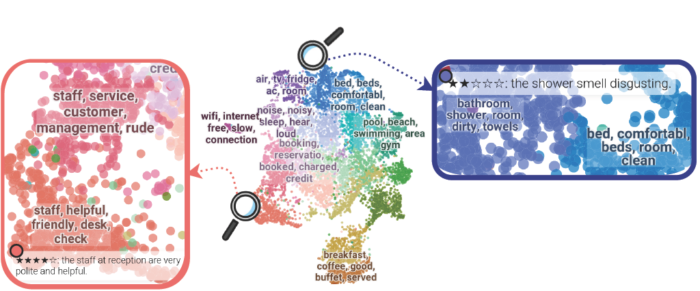

<!-- ANONYMITY (remove before camera-ready): host anonymously for ARR, strip author/affiliation names, replace <anonymous> placeholders. -->

# Tourism Mining: Guided In-Batch Negative Filtering Enables Domain Adaptation of Sentence Embeddings for Opinion Mining



**TourCSE** is [`all-mpnet-base-v2`](https://huggingface.co/sentence-transformers/all-mpnet-base-v2) fine-tuned on 1M TripAdvisor sentence pairs with guided in-batch negative filtering ([GISTEmbed](https://arxiv.org/abs/2402.16829)), so that embeddings capture both the topic and the sentiment of tourism reviews. This repo contains the code to build the training pairs, train the 27 configurations (3 seeds each) and run the evaluations.

## Results

MAP@100 on opinion retrieval (queries like `service terrible`). TourCSE: LoRA r = 32, GTE-ModernBERT guide, m = 0, mean of 3 seeds.

| Model | Tourism | Laptop (OOD) | NanoBEIR (OOD) |
|---|---|---|---|
| all-mpnet-base-v2 | 52.8 | 29.0 | 49.4 |
| GTE-ModernBERT (best General) | 57.2 | 32.2 | 58.7 |
| StanceAware-SBERT (best Opinion Mining) | 59.0 | 30.7 | 38.7 |
| **TourCSE → Sentiment** | 63.2 | 35.3 | 47.4 |
| **TourCSE → Opinion** | 67.2 | 35.3 | 46.9 |

## Models

| Model | Positives | Hugging Face |
|---|---|---|
| `TourCSE-mpnet-base-v2` | Sentiment (star ratings) | `<anonymous>/TourCSE-mpnet-base-v2` |
| `Llama-TourCSE-mpnet-base-v2` | Opinion (sentiment + LLM topics) | `<anonymous>/Llama-TourCSE-mpnet-base-v2` |

```python
from sentence_transformers import SentenceTransformer

model = SentenceTransformer("<anonymous>/TourCSE-mpnet-base-v2")
q = model.encode(["service terrible"], normalize_embeddings=True)
s = model.encode(["The staff ignored us for twenty minutes.",
                  "The room was clean and spacious."], normalize_embeddings=True)
print(model.similarity(q, s))
```

## Installation

Python ≥ 3.11. Tested with Sentence Transformers 6, Transformers 5.17, PyTorch 2.14, one H100 GPU.

```sh
pip install -r requirements.txt            # training and evaluation
pip install -r requirements_topicgpt.txt   # LLM annotation (separate environment)
```

For gated models (e.g. Llama-3.1-8B-Instruct), set `HUGGINGFACEHUB_API_TOKEN` in a `.env` file.

## Training data

Download the datasets yourself (not redistributed here) and place the csv files as below:

- **Hotel**: [HotelRec](https://github.com/Diego999/HotelRec) → `data/raw/hotel/comment_{1..7}.csv`
- **Restaurant**: [TripAdvisor Dyadic Context](https://zenodo.org/record/6583422) → `data/raw/restaurant/{Barcelona,London,Madrid,New_Delhi,New_York,Paris}_reviews.csv`
- **Language ID**: [`lid.176.bin`](https://fasttext.cc/docs/en/language-identification.html) → `data/fasttext/`

```text
.
├── task_extract_review.py       # extract reviews from csv, filter language
├── task_extract_sample.py       # preprocessing / sampling
├── task_positive_simcse.py      # Semantic positives
├── task_positive_senticse.py    # Sentiment positives
├── task_positive_topicgpt.py    # Opinion positives (LLM topics)
├── task_build_batch.py          # builds experiments.tsv
├── script_train.sh              # runs all experiments
├── task_evaluate_ir.py          # MAP@100, NDCG@10
└── task_evaluate_cluster.py     # silhouette, Calinski–Harabasz, Davies–Bouldin
```

We sample 100k English reviews per domain (20k per star rating), split them into sentences (NLTK), and build 500k pairs per domain (1M in total):

| Strategy | Positive |
|---|---|
| Semantic | dropout-augmented copy of the anchor (SimCSE) |
| Sentiment | sentence with the same polarity (star ratings as pseudo-labels) |
| Opinion | sentence with the same polarity and a shared topic (`Llama-3.1-8B-Instruct`, TopicGPT-style prompt) |

## Training

```sh
# Generate Positive Samping Strategies
python task_positive_simcse.py
python task_positive_senticse.py
python task_positive_topicgpt.py   # use requirements_topicgpt.txt environment
# generates experiments.tsv
python task_build_batch.py
# Run all configurations in experiments.tsv
sh script_train.sh
```

**Grid (27 configurations):** strategy {Semantic, Sentiment, Opinion} × guide {none, `all-mpnet-base-v2`, `StanceAware-SBERT`, `GTE-ModernBERT`} × LoRA {none, r = 8, r = 32}, each with seeds 42, 128, 256.

**Hyperparameters:** batch 32, 1 epoch, lr 2e-5 (1e-4 with LoRA), linear schedule with 10 % warm-up, AdamW, BF16, τ = 0.05, margin m = 0. A run takes about 15–45 min on one H100.

## Evaluation

Datasets: Restaurant (ACOS), Hotel (OATS), Laptop (ACOS), NanoBEIR (13 English datasets). Already provided

```sh
python task_evaluate_ir.py
python task_evaluate_cluster.py
```

## Limitations

English hotel/restaurant reviews only. Sentiment labels come from star ratings and topics from an LLM, so both are noisy. No bias evaluation was run. Intended for non-commercial research (full ethics sheet in the paper, Appendix G).

## License

| Artifact | License |
|---|---|
| Code | [GNU GPL-3](LICENCE) |
| Released models | [CC BY-NC 4.0](https://creativecommons.org/licenses/by-nc/4.0/); the Opinion model is also under the [Llama 3.1 Community License](https://github.com/meta-llama/llama-models/blob/main/models/llama3_1/LICENSE) (**Built with Llama**) |
| HotelRec / Dyadic Context data | "Academic use only" / CC BY-NC 4.0, see the dataset pages |

## Citation

```bibtex
@inproceedings{anonymous2027tourcse,
  title     = {Tourism Mining: Guided In-Batch Negative Filtering Enables Domain Adaptation of Sentence Embeddings for Opinion Mining},
  author    = {Anonymous},
  booktitle = {Under review},
  year      = {2027}
}
```